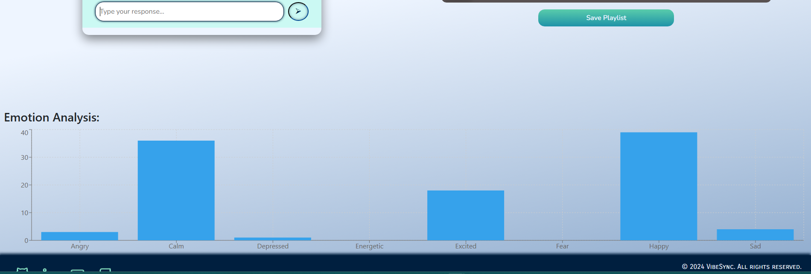

# VibeSync: Emotion-Based Music Recommendation System

VibeSync is my Final Year Project (FYP) for my Bachelor's degree in Computer Science. It is an emotion-based music recommendation system integrated with a chatbot for seamless user interaction. The project leverages advanced AI and machine learning techniques to classify songs using weighted emotion labels, allowing for a deeper understanding of user needs. Unlike traditional recommendation systems, VibeSync dynamically adapts to individual emotional states and experiences in real time, offering more personalized and meaningful music suggestions.

## Project Overview
VibeSync is an innovative application designed to recommend music based on user emotions, with features including:
- **Emotion Recognition**: Detect user emotions through text and recommend songs accordingly.
- **Music Recommendation**: Utilize advanced hybrid recommendation techniques.
- **Integrated Chatbot**: A chatbot powered by Rasa for an interactive experience.
- **Multi-Modal Inputs**: Context-aware recommendations based on user preferences.

> **Note**: The Emotion Recognition model itself is not included in this repository. Only the training pipeline and structure are provided.

## File Structure
```
Chatbot Data Processing               - Process data to train the chatbot
Chatbot Model                         - Fine-tuned model of the chatbot
Music Data Processing                 - Process data to train the music emotion prediction model
Emotion Recognition Model Training    - Classify songs with emotion labels
site                                  - Main web application
site/backend                          - Backend services of the web application
site/chatbot                          - Chatbot model of the application
```

## Prerequisites

### Backend
- **Python**: Version 3.9 or higher
- **Dependencies**: Listed in `backend/requirements.txt`
- **Rasa**: Installed for chatbot functionality

### Frontend
- **Node.js**: Version 14 or higher
- **Dependencies**: Listed in `package.json`

## Setup Instructions

### Step 1: Clone the Repository
```bash
git clone <repository_url>
cd site
```

### Step 2: Set Up the Backend
1. Navigate to the backend directory:
   ```bash
   cd backend
   ```
2. Create and activate a Python virtual environment:
   ```bash
   python3.9 -m venv venv
   source venv/bin/activate
   ```
3. Install dependencies:
   ```bash
   pip install -r requirements.txt
   ```

### Step 3: Set Up Rasa
1. Navigate to the `chatbot` directory:
   ```bash
   cd chatbot
   ```
2. Train the Rasa model:
   ```bash
   rasa train
   ```

### Step 4: Set Up the Frontend
1. Navigate back to the root directory:
   ```bash
   cd ../../
   ```
2. Install Node.js dependencies:
   ```bash
   npm install
   ```

## Running the Project
To start the application, follow these steps:

### 1. Run Backend Services
Run all backend scripts in separate terminals or using the provided script:
```bash
./run_site.sh
```

### 2. Start Rasa Chatbot
- Open a terminal and navigate to `backend/chatbot`.
- Run Rasa actions:
  ```bash
  rasa run actions
  ```
- In another terminal, run the Rasa server:
  ```bash
  rasa run --enable-api --cors "*"
  ```

### 3. Start the React App
Navigate to the root directory and run:
```bash
npm start
```

## Screenshots

### Home Page


### Chatbot Interaction




### Playlist Insertion


## Important Information
- The Emotion Recognition model weights are not included in this repository.
- All API tokens and access keys provided in the repository are intentionally invalid and are for placeholder/demo purposes only.

## Contribution Guidelines
- Fork the repository and create feature branches for any changes.
- Submit pull requests for review before merging into the main branch.

## Contact
For questions or issues, please contact Lester Koon at lester.koon.zm@gmail.com
